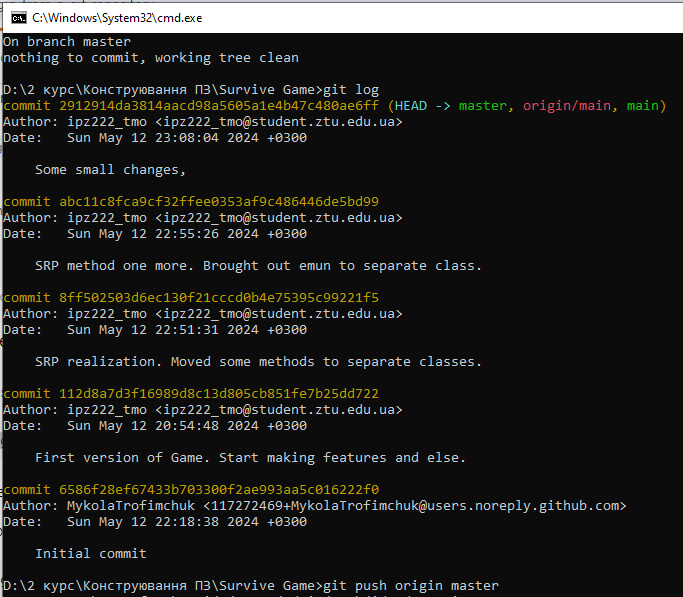

# Survive-If-You-Can-2024
lab-6 KPZ by Trofimchuk Mykola IPZ-22-2 || (Game Survive If You Can)

*Скриншот **git log**, на якому видно, що програма написана та закомічена **вчасно**.*

# Survive IF You Can

Survive IF You Can is a Windows Forms game where the player must survive waves of zombies by shooting them and collecting ammo. The player can move in four directions, shoot bullets, and encounter zombies. The game features a pause functionality and keeps track of the player's score and health.

## Programming Principles

In developing this game, several core programming principles were followed to ensure clean, maintainable, and efficient code:

1. **Single Responsibility Principle (SRP)**: Each class has a single responsibility. For example, the `Player` class is responsible for player attributes and movements, while the `Ammo` class handles the dropping of ammo.
2. **Open/Closed Principle (OCP)**: The system is open for extension but closed for modification. This can be seen in how new types of shooting behaviors can be added by extending the `IShooting` interface without modifying existing code.
3. **Liskov Substitution Principle (LSP)**: Objects of a superclass should be replaceable with objects of a subclass without affecting the functionality. This principle is adhered to by using interfaces such as `IShooting` and implementing them in classes like `Bullet`.
4. **Interface Segregation Principle (ISP)**: Many client-specific interfaces are better than one general-purpose interface. This principle is reflected in the separation of concerns between interfaces and their implementations, such as the `IShooting` interface.
5. **Dependency Inversion Principle (DIP)**: High-level modules should not depend on low-level modules; both should depend on abstractions. For example, the `ShootingFactory` depends on the `IShooting` interface, not on the concrete `Bullet` class.

## Design Patterns

Several design patterns were applied in the development of this game:

1. **Factory Pattern**: The `ShootingFactory` class is used to create instances of bullets. This pattern helps in creating objects without exposing the instantiation logic to the client and refers to the newly created object through a common interface (`IShooting`).
    - **File**: [ShootingFactory.cs](./Survive_IF_You_Can/ShootingFactory.cs)
2. **Singleton Pattern**: The `Random` instance used in multiple classes like `Ammo` and `ZomboSpawn` ensures that a single instance of `Random` is used throughout the application, avoiding unnecessary instantiations.
    - **File**: [Ammo.cs](./Survive_IF_You_Can/Ammo.cs), [ZomboSpawn.cs](./Survive_IF_You_Can/ZomboSpawn.cs)
3. **Observer Pattern**: The game uses a custom `Timer` to control the game loop and updates the game state, which is similar to the observer pattern where the timer notifies the game to update its state.
    - **File**: [MainGameForm.cs](./Survive-IF-You-Can/Views/MainGameForm.cs)

## Refactoring Techniques

During the development, several refactoring techniques were employed to improve the code structure and maintainability:

1. **Extract Method**: Large methods were broken down into smaller, more manageable methods. For instance, the `GameEngine` method in `MainGameForm` was split into multiple methods like `UpdatePlayerMovement`, `ShowDeadZombo`, and `MoveTowardsPlayer`.
2. **Introduce Parameter Object**: Parameters that were frequently passed together were bundled into objects. For example, player movement data was encapsulated in the `PlayerMovementController` class.
3. **Encapsulate Field**: Fields were made private and accessed via public properties or methods to control how they are read and modified. This technique was used in classes like `Player` and `Zombie`.

## How to Run

1. Clone the repository.
2. Open the project in Visual Studio.
3. Build and run the project.

## Controls

- **W/A/S/D or Arrow Keys**: Move the player up, left, down, and right.
- **Mouse Left-Click**: Shoot bullets in the direction the player is facing.
- **Esc**: Pause or resume the game.

## Future Enhancements

- Adding more zombie types with different behaviors.
- Implementing power-ups and special weapons.
- Enhancing the game's graphics and sound effects.

## License

This project is licensed under the MIT License.
